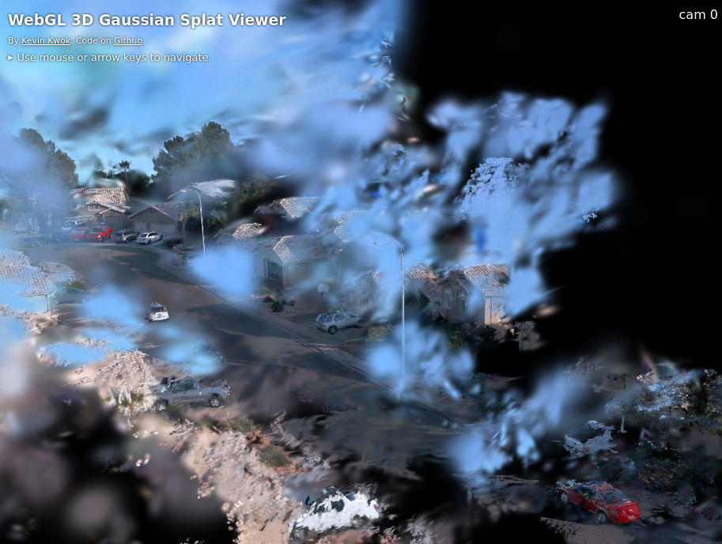

## Setup for GaussianPro

Setup for <b>[GaussianPro: 3D Gaussian Splatting with Progressive Propagation](https://github.com/kcheng1021/GaussianPro)</b>

### Tested Environment
Ubuntu 22.04.4 LTS, RTX3060, CUDA 11.8 (Tested)

Ubuntu 22.04.4 LTS, RTX4090, CUDA 11.8 (Tested)

### Clone the repo
```shell
git clone https://github.com/kcheong/GaussianPro.git --recursive
```

```shell
conda env create --file environment.yml
conda activate gaussianpro
```

```shell
conda install -c conda-forge opencv
```

Set `include_dirs` and `library_dirs` in `./submodules/Propagation/setup.py`

```python
from setuptools import setup
from torch.utils.cpp_extension import BuildExtension, CUDAExtension

import os.path as osp
ROOT = osp.dirname(osp.abspath(__file__))

setup(
    name='gaussianpro',
    ext_modules=[
        CUDAExtension('gaussianpro',
            """
            include_dirs=['/data/kcheng/anaconda3/envs/procuda/include/opencv4', '/usr/local/cuda-11.7/include', '.'],
            library_dirs=['/data/kcheng/anaconda3/envs/procuda/lib'],
            """
            include_dirs=['/home/ahn/anaconda3/envs/gaussianpro/include/opencv4', '/usr/local/cuda-11.8/include', '.'],
            library_dirs=['/home/ahn/anaconda3/envs/gaussianpro/lib'],
            libraries=['opencv_core', 'opencv_imgproc', 'opencv_highgui', 'opencv_imgcodecs'],  
            sources=[
                'PatchMatch.cpp', 
                'Propagation.cu',
                'pro.cpp'
            ],
            extra_compile_args={
                'cxx': ['-O3'],
                'nvcc': ['-O3',
                    '-gencode=arch=compute_86,code=sm_86',
                ]
            }),
    ],
    cmdclass={ 'build_ext' : BuildExtension }
)
```
### Install `Propagation` and some libraries
```shell
pip install ./submodules/Propagation
pip install matplotlib open3d imageio gdown
```

### Download the demo Waymo scence: Segment-102751 and set diretories
`wget` doesn't work properly
```shell
gdown --id 1DXQRBcUIrnIC33WNq8pVLKZ_W1VwON3k
```

```shell
unzip segment-102751.zip -d ./waymo_demo
```


Set `$path/to/data$` and `$save_path$` in `./scripts/waymo.sh`

I modified like this

```bash
#!/bin/bash

DATA_PATH = "./waymo_demo/segment-102751"
SAVE_PATH = "./waymo_demo/result"

python train.py -s $DATA_PATH -m $SAVE_PATH \
                --eval --position_lr_init 0.000016 --scaling_lr 0.001 --percent_dense 0.0005 --port 1021 --dataset waymo 

python render.py -m $SAVE_PATH
python metrics.py -m $SAVE_PATH

python train.py -s $DATA_PATH -m $SAVE_PATH \
                --eval --flatten_loss --position_lr_init 0.000016 --scaling_lr 0.001 --percent_dense 0.0005 --port 1021 --dataset waymo \
                --sky_seg --normal_loss --depth_loss --propagation_interval 30 --depth_error_min_threshold 0.8 --depth_error_max_threshold 1.0 \
                --propagated_iteration_begin 1000 --propagated_iteration_after 12000 --patch_size 20 --lambda_l1_normal 0.001 --lambda_cos_normal 0.001
 
python render.py -m $SAVE_PATH
python metrics.py -m $SAVE_PATH
```

### Run
```shell
bash ./script/waymo.sh
```

### Result
 </img>

Used `Splat` [WebGL 3D Gaussian Splat Viewer](https://github.com/antimatter15/splat)

